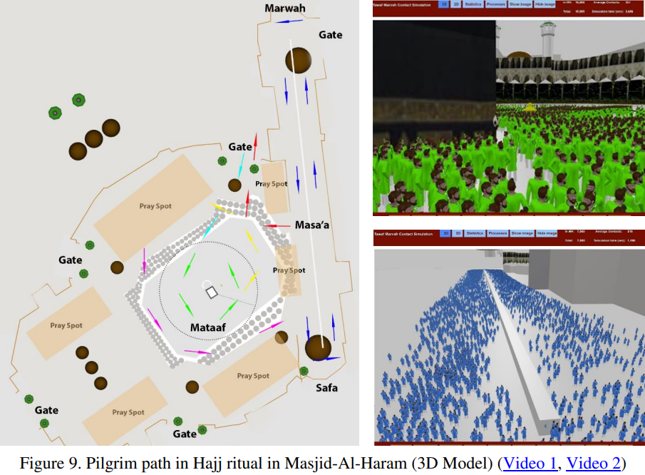
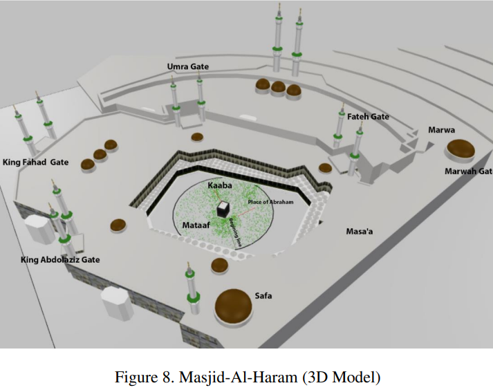
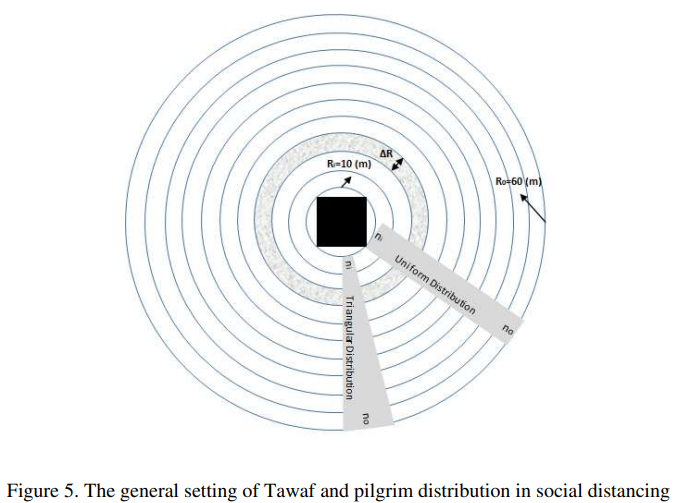

# Agent-based models

6 April 2022 

Julien Arino   

Department of Mathematics & Data Science Nexus
University of Manitoba*

Canadian Centre for Disease Modelling
Canadian COVID-19 Mathematical Modelling Task Force
NSERC-PHAC EID Modelling Consortium (CANMOD, MfPH, OMNI/RÉUNIS)

* The University of Manitoba campuses are located on original lands of Anishinaabeg, Cree, Oji-Cree, Dakota and Dene peoples, and on the homeland of the Métis Nation.

---

<!-- _backgroundImage: "radial-gradient(white,80%,#f1c40f)" -->
# Outline

- What are agent-based models (ABM)
- When to use ABM
- When not to use ABM
- Some examples

---

<!-- _backgroundImage: "linear-gradient(to bottom, #f1c40f, 20%, white)" -->
# <!--fit-->What are agent-based models (ABM)

---

# ABM $\neq$ IBM

- Early in the life of these models, they were called IBM (individual-based models)
- Over the years, a "philosophical" distinction has emerged:
  - IBM are mathematical models that consider individuals as the units; e.g., DTMC, CTMC, branching processes, etc.
  - ABM are computational models whose study is, for the most part, only possible numerically 

---

# ABM vs Network models

- Network models endow vertices with simple systems and couple them through graphs
- Can be ABM, but some networks can also be studied analytically
- Not enough time to go into this, a very interesting subject!

---

<!-- _backgroundImage: "linear-gradient(to bottom, #f1c40f, 20%, white)" -->
# <!--fit-->When to use ABM

---

# ABM are very useful to decipher contact processes

- Classic mathematical models capture contact by using approximations of what contact could be like
- Classic models allow some flexibility (see section about incidence functions in [Lecture 02](https://julien-arino.github.io/3MC-course-epidemiological-modelling/2022_04_3MC_EpiModelling_L02_BasicMathEpi.html)) but they remain limited
- ABM can model actual trajectories of individuals, so given a definition of what a contact is (how close do you need to be for a contact to take place), can count them efficaciously

---

# ABM are very useful to understand behavioural responses

---

<!-- _backgroundImage: "linear-gradient(to bottom, #f1c40f, 20%, white)" -->
# <!--fit-->When not to use ABM

---

# As with _all_ tools, beware!

- There is a law of large numbers effects happening often: if you have many units, unless some emergent behaviour arises, you get the same results using ODEs...

---

<!-- _backgroundImage: "linear-gradient(to bottom, #f1c40f, 20%, white)" -->
# <!--fit-->Some examples

---

# Social contacts during Hajj

- In a mass gathering event like Hajj, lots of people come together originating from many countries
- So if propagation occurs during the event, this has the capacity to spread infection far and wide when individuals (pilgrims here) return home
- Contacts during part of the event are really specific in their configuration
- Word of warning: I am a little fuzzy on the specifics :)

Tofighi, Asgary, Tofighi, Najafabadi, Arino, Amiche, Rahman, McCarthy, Bragazzi, Thommes,  Coudeville, Grunnill, Bourouiba and Wu. [Estimating Social Contacts in Mass Gatherings for Disease Outbreak Prevention and Management (Case of Hajj Pilgrimage)](http://dx.doi.org/10.2139/ssrn.3678581), Tropical Diseases, Travel Medicine and Vaccines

---

# The setup

- Pilgrims enter Masjid al-Haram mosque through several gates
- Proceed to Mataaf (area around Kaaba), circle the Kaaba 7 times counterclockwise (process is the *Tawaf*)
- Then do seven trips between Safa and Marwah (process is the *Sa'ee*)

---

---

# Tawaf in pre-COVID-19 times

<iframe width="560" height="315" src="https://www.youtube.com/embed/L-YyR1oN66w" title="YouTube video player" frameborder="0" allow="accelerometer; autoplay; clipboard-write; encrypted-media; gyroscope; picture-in-picture" allowfullscreen></iframe>

---

# Tawaf - Socially distanced version

<iframe width="560" height="315" src="https://www.youtube.com/embed/Rl8a0wQePCo" title="YouTube video player" frameborder="0" allow="accelerometer; autoplay; clipboard-write; encrypted-media; gyroscope; picture-in-picture" allowfullscreen></iframe>

---

# Sa'ee in pre-COVID-19 times

<iframe width="560" height="315" src="https://www.youtube.com/embed/r1qM-mHj2d0" title="YouTube video player" frameborder="0" allow="accelerometer; autoplay; clipboard-write; encrypted-media; gyroscope; picture-in-picture" allowfullscreen></iframe>

---

# Sa'ee - Socially distanced version

<iframe width="560" height="315" src="https://www.youtube.com/embed/JVges7Q2Mow" title="YouTube video player" frameborder="0" allow="accelerometer; autoplay; clipboard-write; encrypted-media; gyroscope; picture-in-picture" allowfullscreen></iframe>

---

- As you can gather from this:
  - Typically high density crowds
  - Very specific mixing pattern

---

---

---

---

<iframe width="1280" height="720" src="https://www.youtube.com/embed/_oOf4uNIghw?loop=1&modestbranding=1&origin=https://julien-arino.github.io/&rel=0" title="YouTube video player" frameborder="0" allow="accelerometer; autoplay; clipboard-write; encrypted-media; gyroscope; picture-in-picture; loop" allowfullscreen>
</iframe>

---

<iframe width="1280" height="720" src="https://www.youtube.com/embed/qcWBi17qKnU?start=9&loop=1&modestbranding=1&origin=https://julien-arino.github.io/&rel=0" title="YouTube video player" frameborder="0" allow="accelerometer; autoplay; clipboard-write; encrypted-media; gyroscope; picture-in-picture; loop" allowfullscreen>
</iframe>

